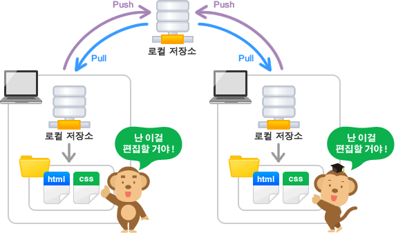
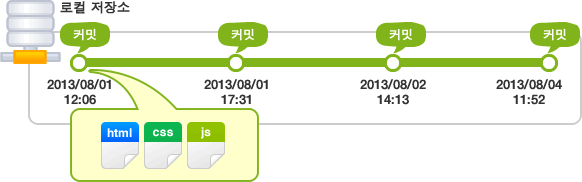
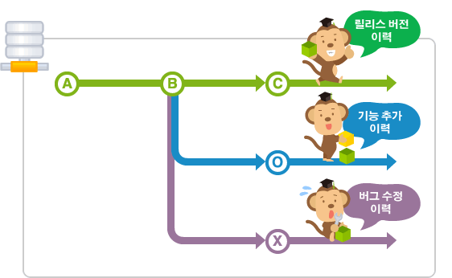

동영상 링크를 눌러주세요!
[동영상 링크]

## 1. 저장소란(Git repository)?
저장소(Git repository)란 말그대로 파일이나 폴더를 저장해 두는 곳입니다. 그런데 Git 저장소가 제공하는 좋은 점 중 하나는 파일이 변경 이력 별로 구분되어 저장된다는 점입니다. 비슷한 파일이라도 실제 내용 일부 문구가 서로 다르면 다른 파일로 인식하기 때문에 파일을 변경 사항 별로 구분해 저장할 수 있습니다.

## 2. 원격 저장소(Remote repository)와 로컬 저장소(Local repository)
Git은 원격 저장소와 로컬 저장소 두 종류의 저장소를 제공합니다. 평소에는 내 PC의 로컬 저장소에서 작업하다가 작업한 내용을 공개하고 싶을 때에 원격 저장소에 업로드 합니다. 물론 원격 저장소에서 다른 사람이 작업한 파일을 로컬 저장소로 가져올 수도 있습니다.

### 2-1. 원격 저장소(Remote Repository)
파일이 원격 저장소 전용 서버에서 관리되며 여러 사람이 함께 공유하기 위한 저장소입니다.

### 2-2. 로컬 저장소(Local Repository)
내 PC에 파일이 저장되는 개인 전용 저장소입니다.

## 3. 커밋(Commit)이란?
파일 및 폴더의 추가/변경 사항을 저장소에 기록하려면 '커밋'이란 버튼을 눌러줘야 합니다. 커밋 버튼을 누르면 이전 커밋 상태부터 현재 상태까지의 변경 이력이 기록된 커밋(혹은 리비전)이 만들어집니다. 커밋은 아래 그림처럼 시간순으로 저장됩니다. 최근 커밋부터 거슬러 올라가면 과거 변경 이력과 내용을 알 수 있겠죠.

## 4. 브랜치(Branch)란?
여러 개발자들이 동시에 다양한 작업을 할 수 있게 만들어 주는 기능이 바로 '브랜치(Branch)' 입니다. 각자 독립적인 작업 영역(저장소) 안에서 마음대로 소스코드를 변경할 수 있지요. 이렇게 분리된 작업 영역에서 변경된 내용은 나중에 원래의 버전과 비교해서 하나의 새로운 버전으로 만들어 낼 수 있습니다.

[동영상 링크]: https://youtu.be/SKmKJviFIE4
